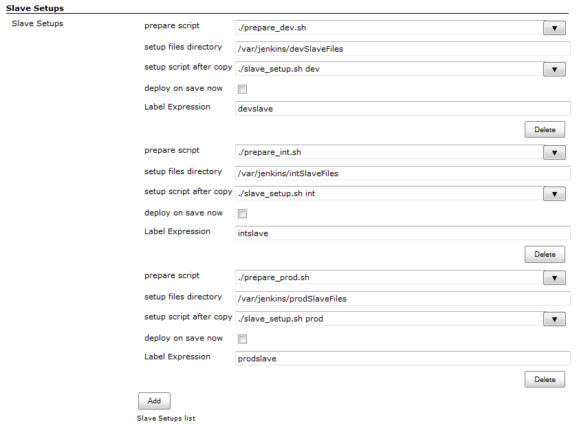
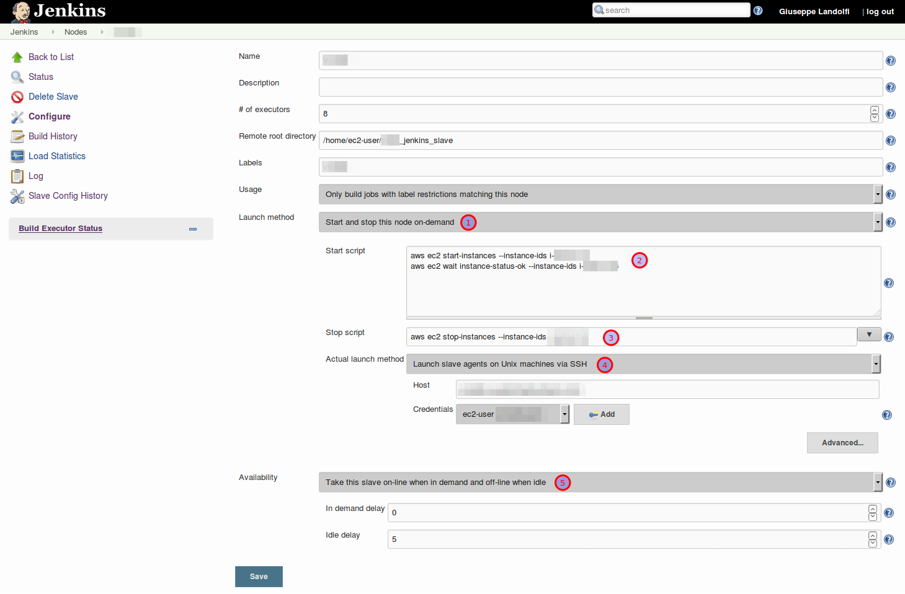

# Agent Setup plugin

This plugin prepares agents for build execution by letting you copy
files and execute scripts before the agents are used.

It also allows you to start and stop agents on demand from the controller.

## Label-based setup

The agent setup plugin gets executed for an agent, if the given label
expression matches and on:

-   Jenkins startup as an agent gets connected.
-   Save of the Jenkins configuration page if the "deploy on save now"
    checkbox is checked.
-   New or re-connection of an agent.

When you install this plugin, it adds a new system configuration section
that lets you specify a list of agent setup items. Each of them have to
following properties:

| Property                | Description                                                                                                                                                                                                                            | Example                                   |
|-------------------------|----------------------------------------------------------------------------------------------------------------------------------------------------------------------------------------------------------------------------------------|-------------------------------------------|
| pre-launch script       | Name of a pre-launch script relative to the **Jenkins home directory**. This can be used to start the agent machine, before Jenkins tries to ssh it.                                                                                   | ./prelaunch.sh                            |
| prepare script          | Name of a prepare script relative to the **jenkins home directory** (not the setup files directory, this has changed in v1.6). This can be used to aggregate files into the setup files directory, patch them, pack them, and so on... | ./prepare\_files.sh                       |
| setup files directory   | Absolute path to the directory that will be copied to the agent.  The contents of this directory are copied to the home directory of the agent.                                                                                        | /var/jenkins/devAgentFiles                |
| setup script after copy | Name of the script that should be executed on the agent after all files are copied. The script should be part of the files to copy.                                                                                                    | ./agent\_setup.sh                         |
| deploy on save now      | If checked, this agent setup item will be executed on save of the Jenkins configuration page.                                                                                                                                          | checked                                   |
| Label Expression        | Like jobs an agent setup item can be configured to be executed only on the agents that match the Label Expression.                                                                                                                      | "agents", "!selenium", "agent1 OR agent2" |

First the directory gets copied, then the script gets run. The execution
of the script is reported to the agent log. When it fails, the agent is
not marked as online, so ill-prepared agents never enter the agent pool.

This provides the administrator of the system an opportunity to prepare
agents to the state suitable for build execution. This works
particularly well in conjunction with tools like Puppet that has
higher-level support for this kind of task.

## On-demand agent setup

This plugin also provides you a per-agent "start" and "stop" script
configuration specific for on-demand agents.

Once installed, you will have an additional **"Launch method" (1)** for
this case:

this one lets you specify the "Start" **(2)** and "Stop" **(3)**
scripts, and on top of that you will be able to **specify the
"conventional" connection (4)** method for reaching the agent after it
has been started.

You will likely also want to specify that you want this node to be
online only when Jenkins needs it **(5)**.

The figure below shows the configuration that you may want to use if
your on-demand agent is an Amazon EC2 instance.

**NOTE:** if your jobs need the agent to be up for being scheduled, you
may end up in a situation where no jobs are scheduled because the agents
are offline, and the agents are not started because no jobs are
scheduled.

A common cause of this situation might be that you are polling Git by
the Git plugin, and "Fast remote polling" (polling from the controller
instead of the agent) is disabled or not working. See the [Git plugin
documentation](https://plugins.jenkins.io/git/)
on how to get the "Fast remote polling" working.

## Version History

[GitHub releases](https://github.com/jenkinsci/agent-setup-plugin/releases) provides changelogs for recent releases.

[CHANGELOG](https://github.com/jenkinsci/agent-setup-plugin/blob/slave-setup-1.12/CHANGELOG.md) provides changelogs for releases before 2014.
